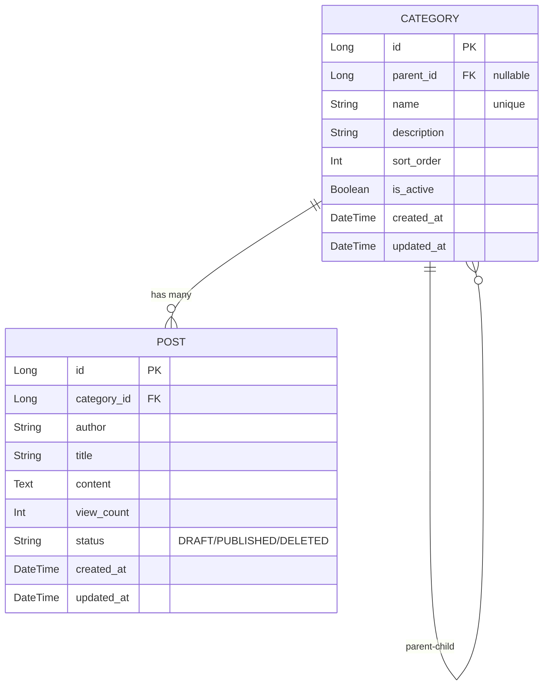

## 코틀린 멀티 모듈 게시판

실무에서 사용하는 코틀린을 경험해 보기 위해 진행

[코틀린 - 자바 멀티모듈 차이점](https://rotomoo.tistory.com/111)

## 프로젝트 구조

```
kotlin-multi-module-board/
├── api/                      # API 모듈 (컨트롤러, Facade, DTO)
├── domain/                   # DOMAIN 모듈 (엔티티, Repository, Service)
├── front/                    # 프론트엔드 (React + Vite)
├── gradle/
│   └── libs.versions.toml    # 공통 버전 관리
├── build.gradle.kts          # 루트
└── settings.gradle.kts       # 모듈 정의
```

## 기술 스택

| 구분 | 기술 |
|------|------|
| Language | Kotlin 2.2 |
| Framework | Spring Boot 4.0 |
| ORM | Spring Data JPA |
| Database | H2 (local), MySQL (dev/prod) |
| Frontend | React 19, Vite 6, TypeScript |
| Build | Gradle (Kotlin DSL) |

## 실행 방법

### 전체 실행 (Backend + Frontend)

```bash
make all
```

### Backend만 실행

```bash
make api
```

- 기본 포트: `8080`
- 기본 프로필: `local` (H2 인메모리 DB)

### Frontend만 실행

```bash
make front
```

- 기본 포트: `5173`
- API 프록시: `http://localhost:8080`

### 기타 명령어

```bash
make install   # 의존성 설치 (Gradle build + npm install)
make clean     # 빌드 정리
```

## 환경 설정

### Local (H2)

기본값으로 H2 인메모리 데이터베이스 사용.

**H2 Console 접속:**
- URL: `http://localhost:8080/h2-console`
- JDBC URL: `jdbc:h2:mem:board`
- User: `sa`
- Password: (비어있음)

### Dev/Prod (MySQL)

`.env` 파일 또는 환경변수로 설정:

```bash
# .env.dev 예시
DB_HOST=localhost
DB_PORT=3306
DB_NAME=board
DB_USERNAME=root
DB_PASSWORD=password
```

```bash
# dev 프로필로 실행
./gradlew :api:bootRun --args='--spring.profiles.active=dev'
```

## API 명세

### 공통 응답 형식

모든 API 응답은 `ApiResponse<T>` 형식으로 래핑

```kotlin
data class ApiResponse<T>(
    val success: Boolean,    // 성공 여부
    val data: T?,            // 실제 데이터
    val message: String?     // 에러 메시지 (실패 시)
)
```

```json
{
  "success": true,
  "data": { "id": 1, "title": "게시글 제목", ... },
  "message": null
}
```

**페이징 응답:**

```kotlin
data class PagedApiResponse<T>(
    val success: Boolean,
    val data: List<T>,
    val pagination: Pagination,
    val message: String?
)

data class Pagination(
    val page: Int,
    val size: Int,
    val totalElements: Long,
    val totalPages: Int
)
```

```json
{
  "success": true,
  "data": [
    { "id": 1, "title": "첫 번째 글", "author": "작성자", ... },
    { "id": 2, "title": "두 번째 글", "author": "작성자", ... }
  ],
  "pagination": {
    "page": 0,
    "size": 20,
    "totalElements": 42,
    "totalPages": 3
  },
  "message": null
}
```

### 카테고리 API

| Method | Endpoint | 설명 |
|--------|----------|------|
| `GET` | `/api/v1/categories` | 전체 카테고리 트리 조회 |
| `GET` | `/api/v1/categories/{id}` | 카테고리 상세 조회 |
| `GET` | `/api/v1/categories/all` | 전체 카테고리 플랫 조회 (관리자용) |
| `GET` | `/api/v1/categories/{id}/children` | 하위 카테고리 조회 |
| `POST` | `/api/v1/categories` | 카테고리 생성 |
| `PUT` | `/api/v1/categories/{id}` | 카테고리 수정 |
| `PATCH` | `/api/v1/categories/{id}/activate` | 카테고리 활성화 |
| `PATCH` | `/api/v1/categories/{id}/deactivate` | 카테고리 비활성화 |
| `DELETE` | `/api/v1/categories/{id}` | 카테고리 삭제 |

**카테고리 구조:**
- 2단계 고정 (상위-하위)
- 하위 카테고리는 자식을 가질 수 없음
- 게시글은 하위 카테고리에만 작성 가능

### 게시글 API

| Method | Endpoint | 설명 |
|--------|----------|------|
| `GET` | `/api/v1/posts` | 게시글 목록 (페이징) |
| `GET` | `/api/v1/posts/{id}` | 게시글 상세 (조회수 증가) |
| `POST` | `/api/v1/posts` | 게시글 생성 |
| `PUT` | `/api/v1/posts/{id}` | 게시글 수정 |
| `DELETE` | `/api/v1/posts/{id}` | 게시글 삭제 (Soft Delete) |
| `GET` | `/api/v1/categories/{categoryId}/posts` | 카테고리별 게시글 |

**Query Parameters (목록 조회):**

| 파라미터 | 타입 | 기본값 | 설명 |
|----------|------|--------|------|
| page | int | 0 | 페이지 번호 |
| size | int | 20 | 페이지 크기 |
| keyword | string | - | 검색어 |
| searchType | string | all | all, title, content, author |

## ERD




